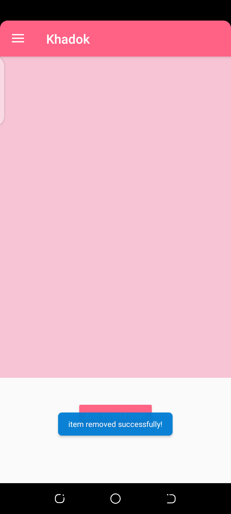

https://drive.google.com/file/d/1woARReslBP2uOdituAo1zpQfUbg2ucTW/view?usp=sharing

Please visit this link for a brief report on the project - KHADOK.

**KHADOK: The Solution to Your Cravings!**

**Salma Abdul Hai**

Student ID: 1731786642

19th January, 2021

Department of Electrical and Computer Engineering

1 **Introduction**

Online home-made food delivery in Bangladesh is becoming increasingly common every

day. People working in Dhaka City have a shared concern for food all the time. Ordering food

from the restaurant in Dhaka is expensive and unhygienic. And if some of the restaurants are

hygienic, most of them are detrimental to health. In addition, millennials are searching for

comfort and time-saving value. Thus, there is an ever-increasing demand for food delivered

to their homes or workplaces. There is no solution for those who are serious with nutritious

eating, except for home-made food.

My Application called KHADOK, aims to tackle the aforementioned issues associated

with food. The goal of this app in simpler words is, to provide nutritious and healthy food to

the user’s doorstep with the fastest home delivery. With a collection of features that allows

users to amplify their food ordering experience, I hope to mitigate a large array of problems.

KHADOK, will allow users to order food in the comfort of their home and get it

delivered on the exact location mentioned by the user, anywhere around the country! Users

will have the option to filter according to their preference and get the corresponding list of

food displayed which would just be a click away from ordering. The users will have the

option to save their favorite home-chefs. With common features like view previous orders,

current orders and the option to either delete or update them (in quantities), the users also

have the option to use the app in local language (Bangla). This is one of KHADOK’s key

features, which is primarily kept for the users that have difficulty reading foreign language.

With KHADOK, the user can make money from cooking a little extra for their family.

Meaning, they can be both a user and a chef at the same time! Years ago, this would have

meant endless paperwork and preparation even before you could get going, but with

KHADOK, the users can get started within hours of signing up. I think this is what

KHADOK is all about—giving people like you a chance to run your own company from

home, at your own time, anytime you want to. So why don't you give it a go? Earn and/or

enjoy the food in the comfort of your home- sweet-home, the choice is yours!

2 **Features**

 **Customer**

o

Simple Login and Registration

o Customer’s Dashboard: Explore chefs and their offered food items

o Place order in just a click

o Review Orders in the order menu item or simply, press the icon on top-

right

o Delete order

o Apply as chef: You can now be both a user and a chef!

 **Chef**

o

Simple registration

o Add food items

o Update food items

o Delete offered food items

         

  **Local Language**

Explore app in Bangla language

o

**3 Data Management**

For most part of this application, I have used both Shared preference and SQLite using he

code first approach, for storing and retrieving the data. For the demonstration purpose of the

app, I have pre-defined some of the information inside my app (local storage). During the

future development of this app, I plan to completely shift to Firebase for much efficient data

storage and managing large-scale data.

**4 Design Pattern**

Due to shortage of time, I haven’t yet followed any software design patterns for this app.

However, this will be taken care of during the future development of this app.

**5 Roadblocks**

There were several roadblocks during the app design and development that were

rectified. However, there is one roadblock that seems to persist. The dashboard of the

customer which has a recycler view that holds all the registered chefs with their respective

offered food items, doesn’t seem to get updated with my registered chef account after I

have successfully created one. I have added a toast message for debugging, it seems to

produce a positive result on inserting the new registered chef (me in this case) into the

database. I have also done the same debugging on retrieving the chef’s information from the

database and displaying it on the customer’s dashboard. Nonetheless, the former

mentioned issue has produced a positive result (i.e was able to get the chef’s information)

but the latter did not show up. It only does so, when the pre-defined chef’s list in my app is

removed completely.

